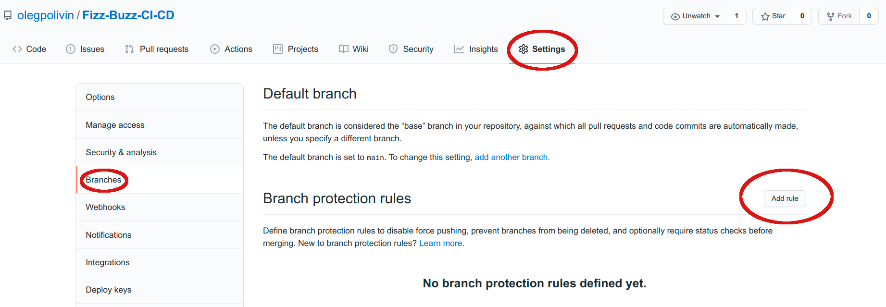

I. Do not push to the master branch
===================================

The idea is that we want the master branch to contain the main code for our project.
Even if we work on our own, it might be a good idea to always push to a different branch,
and then integrate the code to the main branch through a pull request (PR).
That way we can introduce various checks on pull requests,
and impose structure on them. Let's see how we can do it in ``GitHub``.

I create an empty repository to illustrate how one sets up a CI/CD pipeline step by step.
::

  https://github.com/olegpolivin/Fizz-Buzz-CI-CD

So far it only contains a ``README.md`` file.
It also has only one ``main`` branch, and nothing else. I clone it locally:

::

  git clone https://github.com/olegpolivin/Fizz-Buzz-CI-CD.git

Rules for branches
******************

As usual I can work on the code, and then push to the ``main`` branch. That's what I want to
prohibit. Go to the ``Settings`` menu for a given repo and choose ``Branches``:

There are two ways to prevent pushing to the ``main`` branch, and you can choose it in the
``Add rule`` section:

1. Require pull request reviews before merging.
As it is written below:
    When enabled, all commits must be made to a non-protected branch and submitted
    via a pull request with the required number of approving reviews and no changes
    requested before it can be merged into a branch that matches this rule.

However, indeed, this will prevent you from pushing to ``main`` branch, but you cannot be a 
reviewer of your own pull request as of ``November 2020``.
Therefore, if you are working on a project alone, this won't let you merge PR into your ``main`` branch.

There is a different way which is setting up a ``CI/CD`` pipeline.
Click on ``Add rule``. Here is the rule that I've added:

.. image:: _static/imgs/03_branch_rule_status.png
   :scale: 50 %
   :align: center

In particular, I've added:

- Require status checks to pass before merging (+ Require branches to be up to date before merging).
    - So far there are none, but we will add them later

- Include administrators.
    - Even if we are alone on the project we don't want to allow ourselves to push to ``main``.

Now how can one set up a ``CI/CD`` pipeline, so as to prevent pushing to the ``main``?

See :ref:`II. Continuous Integration / Continuous Delivery` section.
