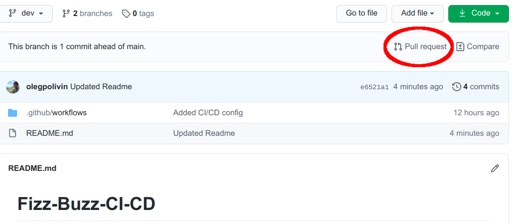

II. Continuous Integration / Continuous Delivery
================================================

In practice one needs to add a config file to the repository under ``.github/workflows`` folder.
My file is located here:
::

  https://github.com/olegpolivin/FizzBuzz-CI-CD/blob/main/.github/workflows/ci.yml

Basic example
**********************************

For example:
::

  # This workflow will install Python dependencies, run tests and lint with a variety of Python versions
  # For more information see: https://help.github.com/actions/language-and-framework-guides/using-python-with-github-actions

  name: CI

  on:
    push:
      branches: [ main ]
    pull_request:
      branches: [ main ]
  jobs:
    build:
      runs-on: ubuntu-latest
      strategy:
        matrix:
          python-version: [3.7]
      steps:
      - uses: actions/checkout@v2
      - name: Set up Python
        uses: actions/setup-python@v2
        with:
          python-version: ${{ matrix.python-version }}
      # You can test your matrix by printing the current Python version
      - name: Display Python version
        run: python -c "import sys; print(sys.version)"

It is not doing anything important. It makes use of ``Github Actions`` and only thing it does
is printing a python version, in my case ``3.7``. However, this is enough for ``Github`` to
prevent you from pushing to the ``main`` branch. It is necessary now to push to a different branch.
Creating a pull request will run the script above. Pull request will always be approved, 
because the script checks nothing. However, the whole procedure prevents you now from pushing 
directly to ``main``. Later we will add code formatters and a linter to this script.

Set up a rule for your branch
**********************************

It is necessary just to add some modifications to the ``Settings -> Branches -> Rules``. See 
what's new:

.. image:: _static/imgs/06_cicd.png
   :scale: 50 %
   :align: center

Notice that ``build (3.7)`` has appeared among statuses. This corresponds to the name of the job
(``build``) and python version ``3.7``.

I made a small modification to the ``README.md`` file, and let's see if I can push it now to
the ``main`` branch. Here is the error I get:
::

  Total 3 (delta 1), reused 0 (delta 0)
  remote: Resolving deltas: 100% (1/1), completed with 1 local object.
  remote: error: GH006: Protected branch update failed for refs/heads/main.
  remote: error: Required status check "build (3.7)" is expected.
  To https://github.com/olegpolivin/FizzBuzz-CI-CD.git
  ! [remote rejected] main -> main (protected branch hook declined)
  error: failed to push some refs to 'https://github.com/olegpolivin/FizzBuzz-CI-CD.git'

Nice! The commit is rejected because a required status check is needed.

Therefore, let's push to a new branch. Locally, let's create a new branch
::

  git checkout -b dev
  git push origin dev

A new branch called ``dev`` is created on the remote repository.
What's left is to create a pull request, and merge it to the ``main`` branch.

It becomes possible to merge after all checks are run:

.. image:: _static/imgs/08_merge.png
   :scale: 50 %
   :align: center

We would like to introduce actions or tests to be performed, before the pull request is 
ready to be approved, so let's produce code that will be actually checked. It will be 
a solution to the ``FizzBuzz`` problem, see the next chapter :ref:`III. FizzBuzz`.