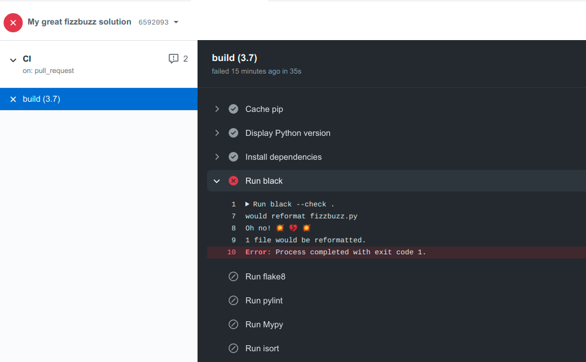

III. FizzBuzz
===================

OK, it is time to write some code!

Definition
***********
Fizz Buzz problem is a task that sometimes people get during coding interviews. 
It goes like this (I take the definition from Joel's book):
..
  Print the numbers from 1 to 100, except that if the number is divisible by 3,
  instead print "fizz"; if the number is divisible by 5, instead print "buzz"; and 
  if the number is divisible by 15, instead print "fizzbuzz".

So, imagine we come up with great code. 
::

    import scipy
    import pandas
    import numpy

    import matplotlib
    from matplotlib import pyplot as plt

    ####### Here I start the solution to the fizz buzz problem #######
    def fizz_buzz(n: int) -> str:
        if n % 15 == 0: return 'fizzbuzz'
        elif n % 5 == 0: return 'buzz'
        elif n % 3 == 0: return 'fizz'
        else: return str(n)

We were in a hurry, so we first imported everything that we usually import, made comments
to visually show where the code starts, and printed ``if``-``return`` statements on the same
line. Clearly, there is no newline at the end of file, who cares since the code is so great!

Actually, we do care because the code needs to be readable and beautiful, and we 
decide that it is a good idea to impose structure on every pull request. Also, code must
pass linter checks and be formatted in a unified manner. It is possible to add all the
necessary checks that we want to impose in the ``ci.yml`` file that we created in the previous
section. Let's say we add:

- ``black`` formatter of the code
- ``isort`` to sort the imports in alphabetical order
- ``flake8`` and ``pylint`` to inspect the code for conformity with good code practices
- ``MyPy`` as a static type checker

Extended GitHub Actions file
*******************************************

That's how the ``ci.yml`` file looks like now:
::

    # This workflow will install Python dependencies, run tests and lint with a variety of Python versions
    # For more information see: https://help.github.com/actions/language-and-framework-guides/using-python-with-github-actions

    name: CI

    on:
    push:
        branches: [ main ]
    pull_request:
        branches: [ main ]
    jobs:
    build:
        runs-on: ubuntu-latest
        strategy:
        matrix:
            python-version: [3.7]
        steps:
        - uses: actions/checkout@v2
        - name: Set up Python
        uses: actions/setup-python@v2
        with:
            python-version: ${{ matrix.python-version }}
        - name: Cache pip
        uses: actions/cache@v1
        with:
        path: ~/.cache/pip # This path is specific to Ubuntu
        # Look to see if there is a cache hit for the corresponding requirements file
        key: ${{ runner.os }}-pip-${{ hashFiles('requirements.txt') }}
        restore-keys: |
            ${{ runner.os }}-pip-
            ${{ runner.os }}-
        # You can test your matrix by printing the current Python version
        - name: Display Python version
        run: python -c "import sys; print(sys.version)"
        - name: Install dependencies
        run: |
            python -m pip install --upgrade pip
            pip install black flake8 mypy pytest hypothesis isort pylint
        - name: Run black
        run:
            black --check .
        - name: Run flake8
        run: flake8 fizzbuzz.py
        - name: Run pylint
        run: pylint fizzbuzz.py
        - name: Run Mypy
        run: mypy fizzbuzz.py
        - name: Run isort
        run: isort --profile black fizzbuzz.py

Let's now try to push the solution above to the repository. And we see that it fails on
the first check. When it fails it does not proceed to the next steps, but it turns out that 
the code above for solving the ``FizzBuzz`` problem will fail on every check.

A better version of ``fizzbuzz.py``
*******************************************

The code below passes all of the checks that we have imposed on it.

::

    """ Function to solve the fizzbuzz problem."""

    def fizz_buzz(num: int) -> str:
        """This is my great and neat function to solve the famous
        Fizz Buzz problem.
        :param num: That's the number which we want the answer for

        :return: fizz, buzz, fizzbuzz or the number itself
        """
        if num % 15 == 0:
            return "fizzbuzz"
        if num % 5 == 0:
            return "buzz"
        if num % 3 == 0:
            return "fizz"
        return str(num)

Now when we push it to the ``dev`` branch, pull requests could be merged into the main
branch since all checks are passed.

Catch the problem before committing
***********************************

It might be that you want to learn that there are problems with your code (that is, 
it does not pass a check that one imposed) before committing. Yes, you will run the tests 
locally, but what if there is an additional point of control that does not allow you 
to commit your changes unless all the checks are passed? It is called a ``Pre-commit hook``,
and more on how to set it up in the next section: :ref:`IV. Pre-commit hook`.