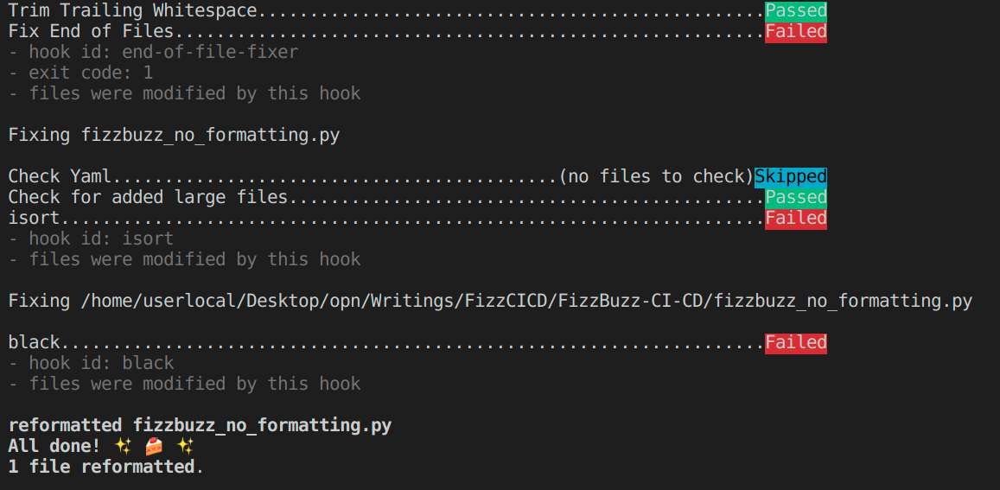

IV. Pre-commit hook
====================================

A pre-commit hook is kind of a script that will be run when you do
::

    git commit -m "<commit message>"

Link to the original description of the `pre-commit hook <https://pre-commit.com/>`_.

Setting up the pre-commit hook
************************************

It is necessary to create a ``.pre-commit-config.yaml`` file in the repository, where you 
would specify all the steps that should be done before the commit is performed. If an error
is encountered, commit does not happen. Below is a simple ``.pre-commit-config.yaml`` configuration
to check that

- code is formatted according to ``black``.
- sorts imports using ``isort``.
- Uses ``flake8`` and ``pylint`` as linters.

::

    repos:
    -   repo: https://github.com/pre-commit/pre-commit-hooks
        rev: v3.2.0
        hooks:
        -   id: trailing-whitespace
        -   id: end-of-file-fixer
        -   id: check-yaml
        -   id: check-added-large-files
    -   repo: https://github.com/pre-commit/mirrors-isort
        rev: f0001b2  # Use the revision sha / tag you want to point at
        hooks:
        -   id: isort
            args: ["--profile", "black"]
    -   repo: https://github.com/psf/black
        rev: 20.8b1
        hooks:
        -   id: black
    -   repo: https://gitlab.com/pycqa/flake8
        rev: 3.7.9
        hooks:
        - id: flake8
    -   repo: local
        hooks:
        -   id: pylint
            name: pylint
            entry: pylint
            language: system
            types: [python]

After the file is created in the repository, run ``pre-commit install`` to install pre-commit
into your git hooks. Et voilà, now the checks will run each time before the commit.

Testing the pre-commit hook
******************************************

Here is a small test: let's change the neat ``fizzbuzz.py`` code to get back to the one that
does not pass the checks and see what happens. Here is a part of the result: it shows 
where it fails, and also modifies the files for corresponding pre-commit hooks (like black
or isort).

Coming back to the neat version of the ``fizzbuzz.py``, the pre-commit hook test is passed.
Nice! That's how it looks like in my case:

.. image:: _static/imgs/11_pre-hook-passed.png
   :scale: 50 %
   :align: center

Finally, we want not to only check the formatting of our code, but also that the code
works correctly. We can add ``testing`` of the code to the ``CI/CD`` pipeline! See chapter
:ref:`V. Testing the code`.
